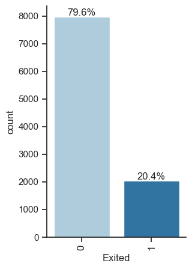
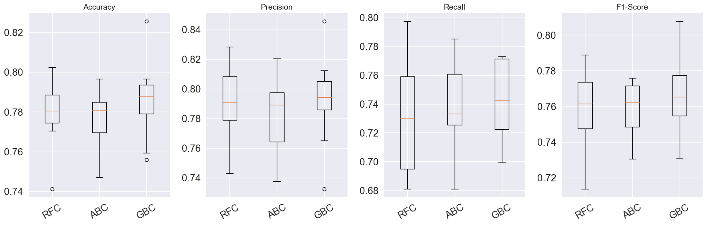
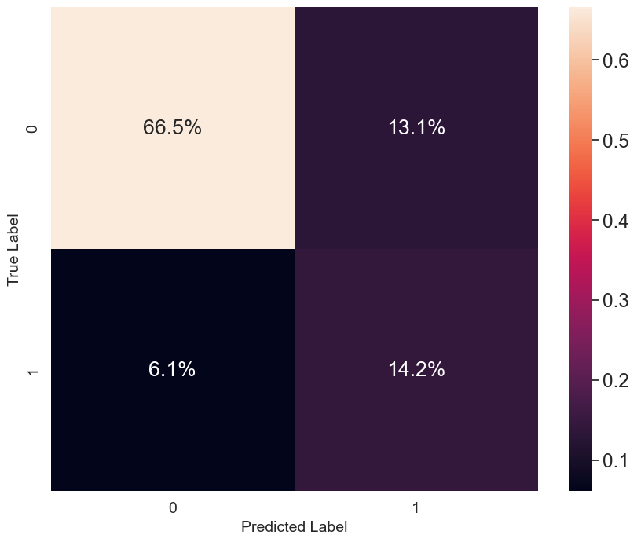

# Bank Customer Churn Prediction

## Problem Statement

In the face of increasing competition within the banking industry, identifying and mitigating customer churn has become a critical concern for our institution. This project aims to develop a predictive model for bank customer churn, leveraging historical transactional and interaction data. By employing advanced analytics and machine learning techniques, we seek to proactively identify at-risk customers, enabling targeted retention strategies and ultimately fostering long-term customer loyalty.

## Data

The data of this project was taken from [Kaggel](https://www.kaggle.com/datasets/marslinoedward/bank-customer-churn-prediction)

## Solution Design
This is a basic binary classification problem as the target variable can only have 2 values. The number of the records which exited the bank is much less than the number of records that are still the customer of the bank. You can see in the below image that the dataset is imbalanced. That's why we decided to not to focus on maximizing the accuracy. Additionaly, by the nature of the problem, the cost of false negatives is higher than the cost of false positives, we decided focusing on maximizing the Recall score.



After cleaning, scaling and applying `imblearn` approaches to the data, we've evaluated below listed methods by using 10-fold ross validation and created a baseline to be used as comparison point:

Linear Algorithms

1. Logistic Regression (LR)
2. Linear Discriminant Analysis (LDA)
3. Non-linear Algorithms

Decision Tree Classifier (DT)

4. Neighbors Classifier (KNN)
5. Support Vector Classifier (SVC)
6. Gaussian Naive Bayes (GNB)

Ensemble Algorithms

7. Random Forest Classifier (RFC)
8. AdaBoost Classifier (ABC)
9. Gradient Boosting Classifier (GBC)



As you can see in the above plot, we chose `RandomForestClassifier` for hyperparameter tuning. We've tuned the hyperparameters as a next step. We used GridSearchCV with 5-fold cross validation to find the hyperparameters that provides the best accuracy score. There were 81 candidates and the details can be seen below.

```
h_params = {
    'max_depth': [10, 50, 100],
    'min_samples_leaf': [1, 2, 4],
    'min_samples_split': [2, 5, 10],
    'n_estimators': [400, 1000, 2000]
    }
```

The prediction that was performed on the test set provided around 78% accuracy with the below hyperparameters which was enough for our original target.

```
{'max_depth': 10,
  'min_samples_leaf': 2,
  'min_samples_split': 10,
  'n_estimators': 1000}
```



As you can see in the above confusion matrix, The percentage of false negatives is small which makes our model is good candidate for further enhancement.